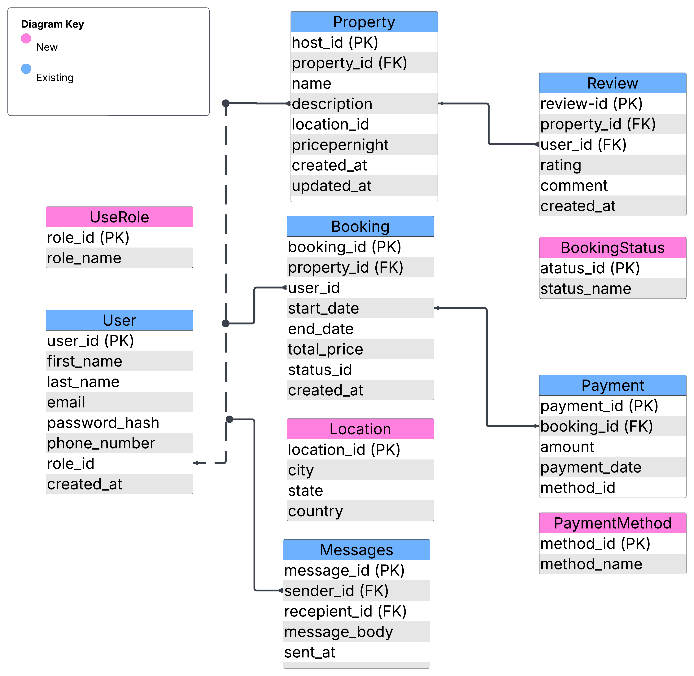

# Airbnb ER Diagram Requirements

## 0. Overview

This document defines the **Entities and Relationships** used in the Airbnb database schema. It is part of the ALX Airbnb Clone project and outlines how the data model supports the core functionalities such as user management, property listings, bookings, reviews, messaging, and payments.

---

## 1. Entities Identified
- User
- Property
- Booking
- Payment
- Review
- Message
---

## 2. Relationships
- User to Property (1:M)
- User to Booking (1:M)
- User to Review (1:M)
- User to Message (1:M) [sender and recipient]
- Property to Booking (1:M)
- Property to Review (1:M)
- Booking to Payment (1:1)

| Relationship                | Type       | Cardinality                            |
|----------------------------|------------|----------------------------------------|
| User → Property            | One-to-Many (1:M) | A host can own multiple properties      |
| User → Booking             | One-to-Many (1:M) | A user can make many bookings           |
| User → Review              | One-to-Many (1:M) | A user can leave multiple reviews       |
| User → Message (sender)    | One-to-Many (1:M) | A user can send many messages           |
| User → Message (recipient) | One-to-Many (1:M) | A user can receive many messages        |
| Property → Booking         | One-to-Many (1:M) | A property can have multiple bookings   |
| Property → Review          | One-to-Many (1:M) | A property can have many reviews        |
| Booking → Payment          | One-to-One (1:1) | Each booking has one payment            |

---

## 3. Diagram

    

